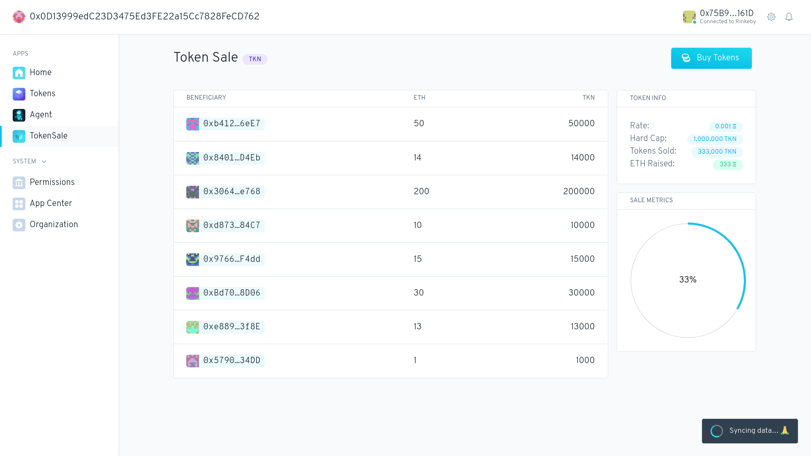

# Token Sale 

> Fixed rate token sale app for Aragon DAOs

## Developer quick start 👩‍💻

`yarn start` will install spin up the app in a DAO on the devchan, with hot reloading.

There are a few other scripts provided:

- `start`: Starts up the app without hot reloading
- `state`: displays the state of the tokensale contract in the cli
- `openSale`: opens the tokensale
- `closeSale`: closes the tokensale
- `buyTokens`: buys one eth of tokens from account[0]

### Libraries

- [**@aragon/os**](https://github.com/aragon/aragonos): AragonApp smart contract interfaces.
- [**@aragon/api**](https://github.com/aragon/aragon.js/tree/master/packages/aragon-api): Aragon client application API.
- [**@aragon/ui**](https://github.com/aragon/aragon-ui): Aragon UI components (in React).
- [**@aragon/buidler-aragon**](https://github.com/aragon/buidler-aragon): Aragon Buidler plugin.

### Aditional Information

We have an additional script `copy-artifacts`. We use this script to get the files of the pre-compiled artifacts from `@aragon/abis`. Their purpose is to use it to deploy the aragonOS framework during local development. In a similar way, they can be used during tests.
